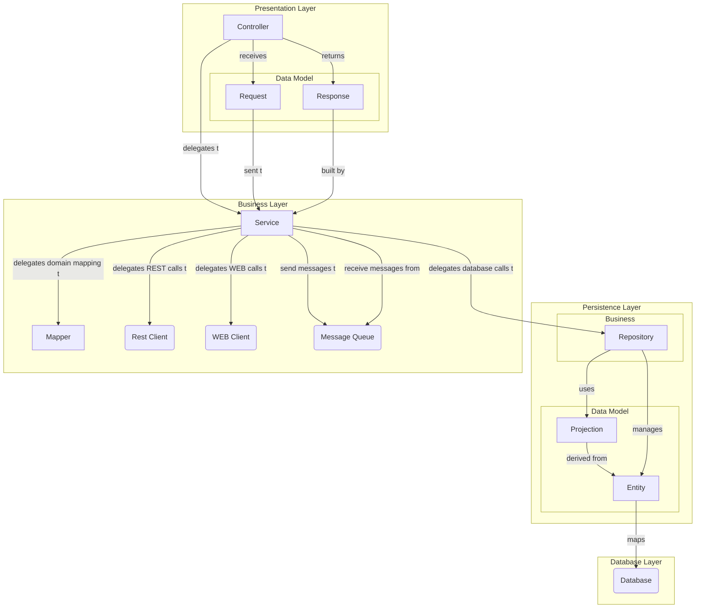

Layered Architecture

```mermaid
graph v
    subgraph Database Layer
        DB(Database)
    end
    subgraph Persistence Layer
        subgraph Data Model
            Projection--derived from-->Entity
        end
        subgraph Business
            Repository
        end
        Entity--maps-->DB
        Repository--manages-->Entity
        Repository--uses-->Projection
    end
    subgraph Business Layer
        Service--delegates database calls to-->Repository
        Service--delegates domain mapping to-->Mapper
        Service--delegates REST calls to-->REST(Rest Client)
        Service--delegates WEB calls to-->WEB(WEB Client)
        Service--send messages to-->MQ(Message Queue)
        Service--receive messages from-->MQ(Message Queue)
    end
    subgraph Presentation Layer
        subgraph Data Model
            Request
            Response
        end
        Controller--receives-->Request
        Controller--returns-->Response
        Controller--delegates to-->Service
        Request--sent to-->Service
        Response--built by-->Service
    end
```
---
