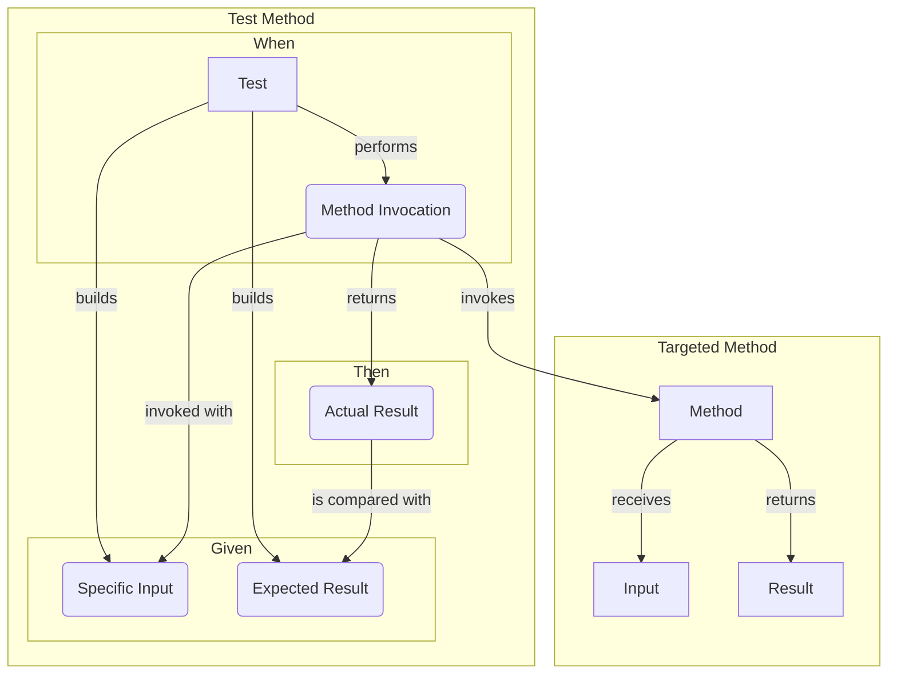
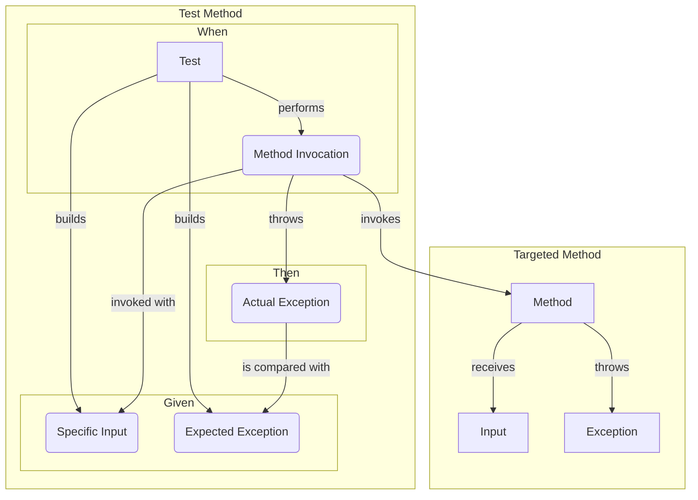

Simple test (Input vs Output)

```mermaid
graph v
    subgraph Targeted Method
        Method--receives-->Input
        Method--returns-->Result
    end
    subgraph Test Method
        subgraph Given
            SI(Specific Input)
            ER(Expected Result)
        end
        subgraph When
            MI(Method Invocation)
            Test--builds-->SI
            Test--builds-->ER
            Test--performs-->MI
            MI--invoked with-->SI
            MI--invokes-->Method
        end
        subgraph Then
            AR(Actual Result)
            MI--returns-->AR
            AR--is compared with-->ER
        end
    end
```
---
Simple test (Input vs Exception)

```mermaid
graph v
    subgraph Targeted Method
        Method--receives-->Input
        Method--throws-->Exception
    end
    subgraph Test Method
        subgraph Given
            SI(Specific Input)
            EE(Expected Exception)
        end
        subgraph When
            MI(Method Invocation)
            Test--builds-->SI
            Test--builds-->EE
            Test--performs-->MI
            MI--invoked with-->SI
            MI--invokes-->Method
        end
        subgraph Then
            AE(Actual Exception)
            MI--throws-->AE
            AE--is compared with-->EE
        end
    end
```